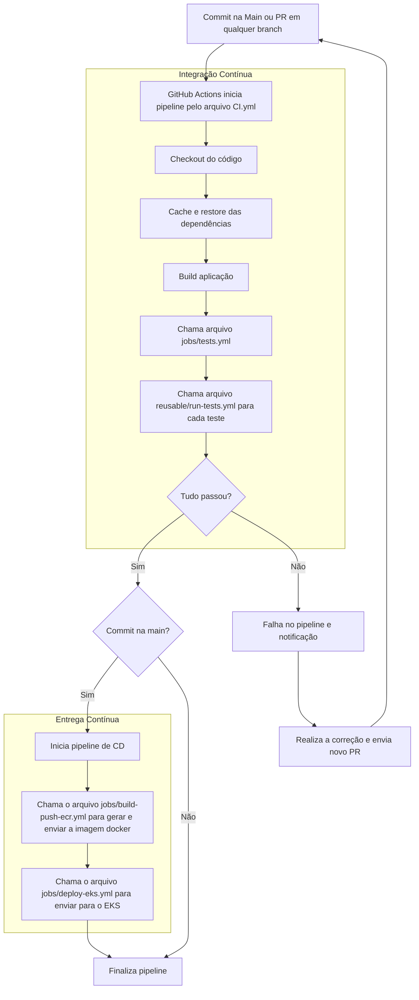

```mermaid
    flowchart TD
        A[Commit na Main ou PR em qualquer branch] --> B[GitHub Actions inicia pipeline pelo arquivo CI.yml]
        
        %% Etapa de Integração Contínua (CI)
        subgraph CI[Integração Contínua]
            B --> C[Checkout do código]
            C --> D[Cache e restore das dependências]
            D --> E[Build aplicação]
            E --> F[Chama arquivo jobs/tests.yml]
            F --> G[Chama arquivo reusable/run-tests.yml para cada teste]
            G --> H{Tudo passou?}
        end
        H --> |Sim| I{Commit na main?}
        H --> |Não| J[Falha no pipeline e notificação]
        J --> K[Realiza a correção e envia novo PR]
        K --> A 
        I --> |Sim| L[Inicia pipeline de CD]
        I --> |Não| M[Finaliza pipeline]

        %% Etapa de Entrega Contínua (CD)
        subgraph CD[Entrega Contínua]
            L --> N[Chama o arquivo jobs/build-push-ecr.yml para gerar e enviar a imagem docker]
            N --> O[Chama o arquivo jobs/deploy-eks.yml para enviar para o EKS]
        end
            O --> M
```