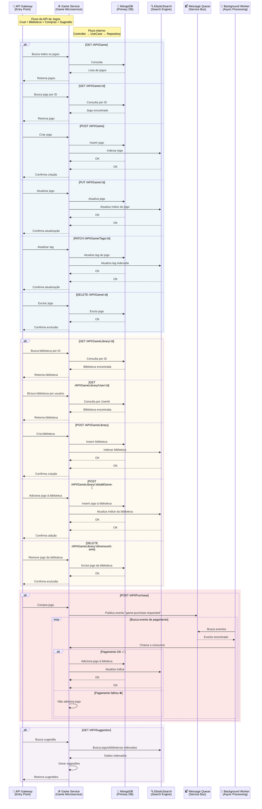

```mermaid
    sequenceDiagram
        %% Participantes
        participant Gateway as 🚪 API Gateway<br/>(Entry Point)
        participant Service as 🌐 Game Service<br/>(Game Microservice)
        participant Mongo as 🌱 MongoDB<br/>(Primary DB)
        participant ES as 🔍 ElasticSearch<br/>(Search Engine)
        participant Queue as 📬 Message Queue<br/>(Service Bus)
        participant Worker as 🔄 Background Worker<br/>(Async Processing)

        %% Contexto da documentação
        Note over Gateway, Service: Fluxo da API de Jogos<br/>Crud + Biblioteca + Compras + Sugestão

        %% Contexto do fluxo interno básico da API
        Note right of Service: Fluxo interno:<br/>Controller → UseCase → Repository
        
        %% ================================
        %% GAME ENDPOINTS
        %% ================================
        rect rgb(173, 216, 230, 0.2)
            alt GET /API/Game
                Gateway ->> Service: Busca todos os jogos
                Service ->> Mongo: Consulta
                Mongo -->> Service: Lista de jogos
                Service -->> Gateway: Retorna jogos

            else GET /API/Game/:id
                Gateway ->> Service: Busca jogo por ID
                Service ->> Mongo: Consulta por ID
                Mongo -->> Service: Jogo encontrado
                Service -->> Gateway: Retorna jogo

            else POST /API/Game
                Gateway ->> Service: Criar jogo
                Service ->> Mongo: Inserir jogo
                Service ->> ES: Indexar jogo
                Mongo -->> Service: OK
                ES -->> Service: OK
                Service -->> Gateway: Confirma criação

            else PUT /API/Game/:id
                Gateway ->> Service: Atualizar jogo
                Service ->> Mongo: Atualiza jogo
                Service ->> ES: Atualiza índice do jogo
                Mongo -->> Service: OK
                ES -->> Service: OK
                Service -->> Gateway: Confirma atualização

            else PATCH /API/Game/Tags/:id
                Gateway ->> Service: Atualizar tag
                Service ->> Mongo: Atualiza tag do jogo
                Service ->> ES: Atualiza tag indexada
                Mongo -->> Service: OK
                ES -->> Service: OK
                Service -->> Gateway: Confirma atualização

            else DELETE /API/Game/:id
                Gateway ->> Service: Excluir jogo
                Service ->> Mongo: Exclui jogo
                Mongo -->> Service: OK
                Service -->> Gateway: Confirma exclusão
            end
        end

        %% ================================
        %% GAMELIBRARY ENDPOINTS
        %% ================================
        rect rgb(255, 228, 181, 0.2)
            alt GET /API/GameLibrary/:id
                Gateway ->> Service: Busca biblioteca por ID
                Service ->> Mongo: Consulta por ID
                Mongo -->> Service: Biblioteca encontrada
                Service -->> Gateway: Retorna biblioteca

            else GET /API/GameLibrary/User/:id
                Gateway ->> Service: BUsca biblioteca por usuário
                Service ->> Mongo: Consulta por UserId
                Mongo -->> Service: Biblioteca encontrada
                Service -->> Gateway: Retorna biblioteca

            else POST /API/GameLibrary
                Gateway ->> Service: Cria biblioteca
                Service ->> Mongo: Inserir biblioteca
                Service ->> ES: Indexar biblioteca
                Mongo -->> Service: OK
                ES -->> Service: OK
                Service -->> Gateway: Confirma criação

            else POST /API/GameLibrary/:id/addGame
                Gateway ->> Service: Adiciona jogo à biblioteca
                Service ->> Mongo: Inserir jogo à biblioteca
                Service ->> ES: Atualiza índice da biblioteca
                Mongo -->> Service: OK
                ES -->> Service: OK
                Service -->> Gateway: Confirma adição

            else DELETE /API/GameLibrary/:id/removeGame
                Gateway ->> Service: Remove jogo da biblioteca
                Service ->> Mongo: Exclui jogo da biblioteca
                Mongo -->> Service: OK
                Service -->> Gateway: Confirma exclusão
            end
        end

        %% ================================
        %% PURCHASE ENDPOINT
        %% ================================
        rect rgb(240, 128, 128, 0.2)
            alt POST /API/Purchase
                Gateway ->> Service: Compra jogo
                Service ->> Queue: Publica evento "game-purchase-requested"

                loop Busca evento de pagamento
                    Worker ->> Queue: Busca eventos
                    Queue -->> Worker: Evento encontrado
                    Worker ->> Service: Chama o consumer
                    
                    alt Pagamento OK ✅ 
                        Service ->> Mongo: Adiciona jogo à bilioteca
                        Service ->> ES: Atualiza índice
                        Mongo -->> Service: OK
                        ES -->> Service: OK
                        else Pagamento falhou ❌
                            Service ->> Service: Não adiciona jogo
                    end
                end
            end
        end

        %% ================================
        %% SUGGESTIONS ENDPOINT
        %% ================================
        rect rgb(216, 191, 216, 0.2)
            alt GET /API/Suggestion 
                Gateway ->> Service: Busca sugestão
                Service ->> ES: Busca jogos/bibliotecas indexadas
                ES -->> Service: Dados indexados
                Service ->> Service: Gerar sugestões
                Service -->> Gateway: Retorna sugestões
            end
        end
```